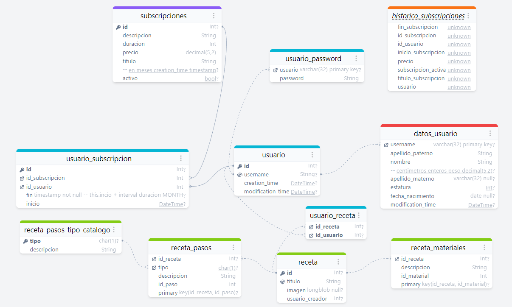

# Proyecto negocios 2022

+ Alumnos:
  + Cristian Romero Andrade
  + Victor Anizar Morales

## Implementación

Se utilizo Amazon Web Services para su implementación

### Stack

+ Amazon Linux como sistema operativo
+ PHP 8.0.16
+ mariaDB 15.1
+ Apache 2.4.53

[Click aquí para ir a la instanción en Ejecución](http://ec2-3-135-63-147.us-east-2.compute.amazonaws.com/) 

## Instalación

Para la configuración del Stack XAMPP véase la configuración de [servidor en la carpeta doc](docs/Servidor/README.md)

[Click aquí para ver el video de instalación](https://drive.google.com/file/d/1eQzedCKyAIe5GolCBDo6TZyv6n_paDU9/view?usp=sharing)

## Estructura

Se optó por usar un marco de trabajo MVC, usando una implementación simple de un enrutador para comunicar nuestra
aplicación, así optando por un estilo REST en al interacción del usuario.

la estructura del proyecto es la siguiente:

### raíz

En la raíz del proyecto vemos los archivos [`index.php`](index.php) y [`route.php`](route.php). `index.php` se encarga de inicializar el proyecto cargando
las clases PHP del proyecto, creando asi sus `namespaces`. `route.php`
inicializa todas las rutas con sus respectivas acciones.

También esta [`.htaccess`](.htaccess), que son las instrucciones especificas del proyecto ante un servidor Apache (véase [instalación](#instalación)).

### conf

La carpeta `conf` contiene nuestras variables para desarrollo y producción.
Aquí se define la conexión a la base de datos y rutas a carpetas del host.

### recetario

Esta carpeta contiene la mayor parte del proyecto.

+ Conexión a la base de datos [`recetario/Model/DataBase.class.php`](recetario/Model/DataBase.class.php).
+ Procesar solicitudes del usuario [`recetario/Model/Router.class.php`](recetario/Controller).
+ Las Vistas a Cargar [`recetario/view`](recetario/view/).
+ Implementación de las reglas de negocio [`recetario/Controller`](recetario/Controller/)
+ Los estilos y scripts que nos ayudará a manipular la web [`recetario/assets`](recetario/assets/)

## Base de datos

La base de datos se compone de once tablas:

## Clases

Se usa PDO para acceder a la base de datos, y cada modelo contiene una conexión a la base de datos cada vez que
se inicializa un objeto de la clase.

## Controlador

El controlador se compone igual de clases pero en su totalidad de métodos estaticos,
esto es con el fin de optimizar el acceso a las regals de negocio y que las llamadas
a aquellos métodos sean relativamente más optimas.

## Vistas

Las vistas son el html que se va a mostrar, estas se llaman mediante métodos GET.
Estas vistas contienen el panel y los formularios necesarios para mostrar el usuario.
el archivo [`recetario/view/panel.view.php`](recetario/view/panel.view.php) llama los
scripts y los estilos en definidos, en este archivo se cargan las demás vistas.

## Enrutador

El enrutador está diseñado pracialmente a prueba de errores, ya que el programador puede
renderizar una exception a páginas que no existen o bien a páginas específicas que los usuarios
no pueden ingresar

---

Repositorio del proyecto - <https://github.com/tysyak/Proyecto_negocios_2022>
